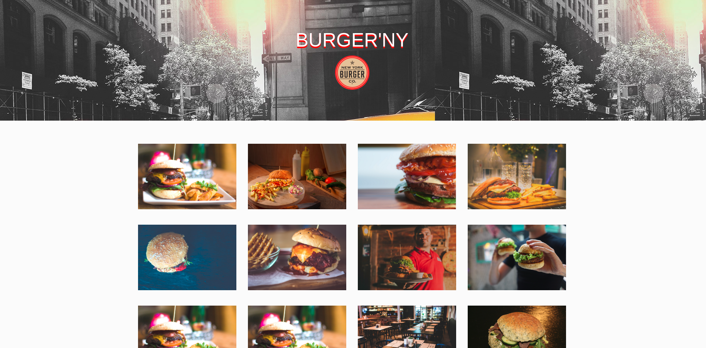

# bootstrap-resto-website

Réalisation d'un site vitrine d'une franchise de restaurants.
Produire min 5 pages

## Date :

Effectué la semaine du 18 au 21 février 2019 en tant que stagiaires chez BeCode

## Langages utilisés :

+ HTML
+ CSS (BOOTSTRAP)
+ JAVASCRIPT

## Progression :

Terminé

## Liens utiles :

lien des consignes : <https://github.com/becodeorg/BXL-Johnson-3.9/tree/master/Projets/Restaurant_Bootstrap>

lien github page : <https://doropro.github.io/bootstrap-resto-website/>
## Aperçu du site :

